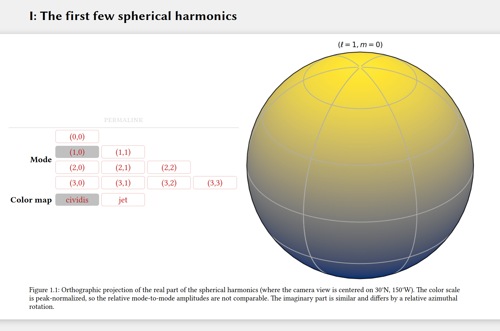

# HTML Figure Pager

*An active example of this Javascript library can be found
[here](https://jmert.github.io/html-figure-pager/index.html).*

This package provides a small, self-contained Javascript library which allows one to
easily create "figure pagers" in their HTML documents.
In my graduate research group, we often had to generate many plots (numbering anywhere from
a handful to many thousands) that showed data in various combinations or processing options.

Beyond a few figures, it is impractical to show all combinations linearly on a page, so we
used the so-called figure pagers to allow interactive selection of a single image to show
at a time from a collection.
For instance, the following screenshot is one simple example where there are two
types of options ("Mode" and "Color map") which can both take on a variety of values.
By clicking on an option, the figure to the right is updated according to a user-defined
mapping from option values to image file name.

